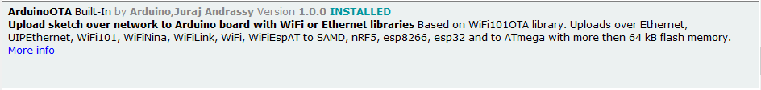
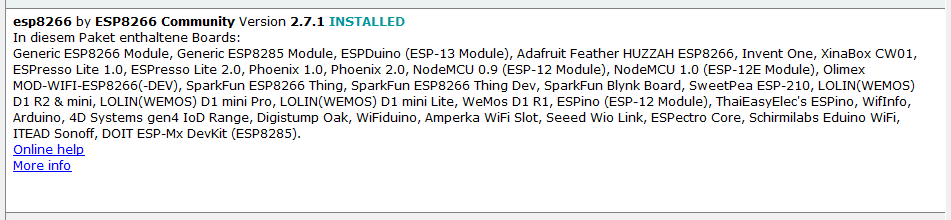
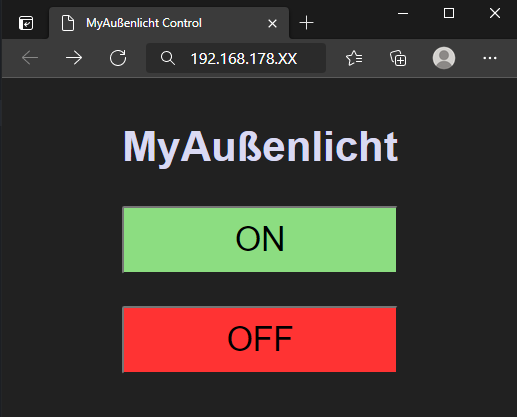
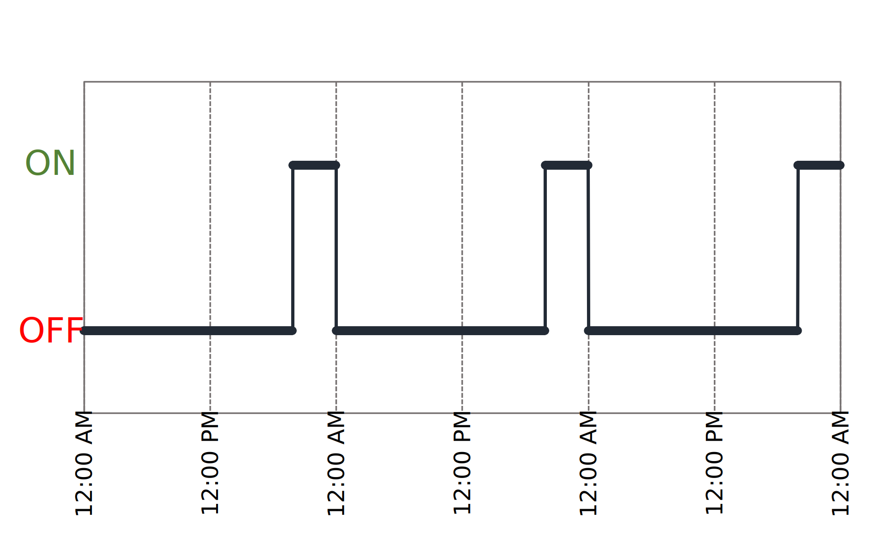

# MyAussenlicht
 [](https://github.com/ModnarUser/MyAussenlicht/actions/workflows/generate_toc.yml)

MyAussenlicht is an ESP2866 based remote control for an outdoor light. A simple server running on the ESP2866, that can be accessed via your local network, is utilized. Two use cases are supported:
* Manual Remote Control
* Automated Remote Control with Sunrise and Sunset 
---

__Table of Contents__
<!--ts-->
* [MyAussenlicht](#myaussenlicht)
   * [1. Requirements](#1-requirements)
   * [2. Build and Run](#2-build-and-run)
   * [3. Manual Remote Control](#3-manual-remote-control)
   * [4. Automated Remote Control](#4-automated-remote-control)
      * [4.1 Requirements](#41-requirements)
      * [4.2 Running It](#42-running-it)
      * [4.3 Example Setup using a QNAP2](#43-example-setup-using-a-qnap2)
         * [4.3.1 Container Setup](#431-container-setup)
         * [4.3.2 Pull Source Code](#432-pull-source-code)
         * [4.3.3 Crontab](#433-crontab)
         * [4.3.4 Debugging](#434-debugging)
      * [4.4 Testing](#44-testing)

<!-- Added by: runner, at: Mon May  3 20:52:30 UTC 2021 -->

<!--te-->
---
## 1. Requirements
* Arduino IDE
* WROOM-32 ESP2866 Dev kit
* ESP-Arduino Lib
* ESP Board Files
## 2. Build and Run
Start the Arduino IDE and make sure you have the latest ESP-Lib installed:



Next, navigate to the board manager in the Arduino IDE and install the esp8266 library:



Open the `MyAussenlicht.ino`-file in the `Embedded` directory and replace the SSID and password in the following lines with your SSID and password:
```CPP
#ifndef STASSID
#define STASSID "YOUR_SSID"
#define STAPSK  "YOUR_PW"
#endif
```

Choose the `LOLIN(WEMOS) D1 R2 & mini` board, connect your board via USB, select the correct COM-port and press `upload to board`.

Upon bootup the ESP-module will attempt to connect to the specified WiFi network:

```bash
Connecting to 
YOUR_WIFI_NAME
Connecting to WiFi
Sent SSID and PW...
................
WiFi connected
Server started
192.168.178.XX
```
## 3. Manual Remote Control
Grab a device already connected to your local network and access the IP address from above (`192.168.178.XX`).



Now you can toggle the Aussenlicht by simply pressing the `ON` or `OFF` button.

## 4. Automated Remote Control
With the python file `MyAussenlichtTimer.py` in the `Python` directory you can automatically switch the Aussenlicht with sunrise and sunset. By default, the outdoor light will be switched on upon sunset and switched off at midnight. 
### 4.1 Requirements
* Machine that is permanently connected to your local Network (e.g. Raspberry Pi, NAS, etc.)
* At least Python 3.6
### 4.2 Running It
Before using it with your Aussenlicht you will have to edit the properties of the `AussenlichtConfig` in the `MyAussenlichtTimer.py` file.

```Python
class AussenlichtConfig():
    AUSSENLICHT_URL = "http://192.168.178.XX" # Enter the URL of your ESP server 
    LATITUDE = 50.0212981 # Enter the latitude of your geo-location
    LONGITUDE = 9.2554408 # Enter the longitude of your geo-location
```
Next, you can execute it.
```bash
cd Python
python MyAussenlichtTimer.py
```

The plot below shows the output of running `MyAussenlichtTimer.py` concurrently every 5 minutes. 


### 4.3 Example Setup using a QNAP2
#### 4.3.1 Container Setup
Log into your qnap2 via a browser of your choice.


Install the `Container Station` from the `AppCenter` and setup a `Ubuntu 18.0` container according to [these instructions](https://www.qnap.com/en/how-to/tutorial/article/how-to-use-container-station). Once the container is setup, launch a shell inside it and set a password for the ubuntu user.
```bash
passwd ubuntu
```
Next, install the following packages.
```bash
sudo apt update && sudo apt upgrade
sudo apt install wget unzip python3-pip nano python3
```
#### 4.3.2 Pull Source Code
Pull this repo from GitHub and unzip it.
```bash
cd /home/ubuntu
mkdir myapps && cd myapps
wget https://github.com/ModnarUser/MyAussenlicht/archive/refs/heads/master.zip
unzip master.zip
sudo rm -rf master.zip
cd MyAussenlicht-master/Python
```
Install the utilized Python libraries and make `MyAussenlichtTimer.py` executable.
```bash
python3 -m pip install -r requirements.txt
chmod +x MyAussenlichtTimer.py
```
#### 4.3.3 Crontab
> Note: depending on your local setup it might be sufficient to edit the user crontab. If this does not work however, you have to additionally edit the system wide crontab.

__A) User Crontab__

Write the currently running cronjobs to a file.
```bash
sudo crontab -l > cronfile
```
Open the file with `nano cronfile` and add the following line:
```bash
*/4 * * * * /usr/bin/python3 /home/ubuntu/myapps/MyAussenlicht-master/Python/MyAussenlichtTimer.py >> /home/ubuntu/myapps/MyAussenlicht-master/Python/MyAussenlichtTimer.log
```

Pass the edited cronfile to `crontab` in order to run the `MyAussenlichtTimer.py` concurrently.
```bash
sudo crontab cronfile
```
Finally, you can check if the cronjob was successfully added with `sudo cronjob -l`.

__B) System Wide Crontab__

Open the system wide crontab at `/etc/crontab`
```bash
sudo nano /etc/crontab
```
Write the following line to the end of the file.
```bash
*/4 * * * * ubuntu /usr/bin/python3 /home/ubuntu/myapps/MyAussenlicht-master/Python/MyAussenlichtTimer.py >> /home/ubuntu/myapps/MyAussenlicht-master/Python/MyAussenlichtTimer.log
```
#### 4.3.4 Debugging
__A) Logfile__

The cronjobs will write logging information to the `MyAussenlichtTimer.log` file. You can check if the MyAussenlichtTimer is running as intended by printing the content of the file to stdout.
```bash
cat /home/ubuntu/myapps/MyAussenlicht-master/Python/MyAussenlichtTimer.log
```
Which will print something like this:

```bash                    
Connection to http://192.168.178.XX successful!                                                                                                                                                                                                                                                        
now: 2021-05-01 10:32:02.210094+00:00    last_midnight: 2021-05-01 00:01:00+00:00        midnight: 2021-05-01 23:59:00+00:00     sunrise: 2021-05-01 04:00:00+00:00                      sunset: 2021-05-01 18:41:00+00:00                                                                             
Außenlicht OFF    
```
__B) Get System Time__
```bash
date "+%H:%M:%S   %d/%m/%y"
```
__C) Print Syslog__
```bash
sudo grep CRON /var/log/syslog
```
### 4.4 Testing
Install all python requirements via

```bash
pip install -r requirements.txt
```

Modify the `TEST_URL` in `test_MyAussenlichtTimer.py` to fit your server URL.
```Python
################################################################
# Test Settings
################################################################

TEST_URL = "http://192.168.178.XX"  # Use URL of your Aussenlicht

```
Navigate into the toplevel Python directory (`*/MyAussenlicht/Python`) and run the tests.

```bash
pytest test_MyAussenlichtTimer.py
```
When all tests were run successfully you should get the following output:

```bash
==================== test session starts =====================
platform linux -- Python 3.8.2, pytest-6.2.3, py-1.10.0, pluggy-0.13.1
rootdir: /data/data/com.termux/files/home/Documents/gitrepos/MyAussenlicht
collected 7 items

test_MyAussenlichtTimer.py .......                     [100%]

===================== 7 passed in 46.44s =====================
```
